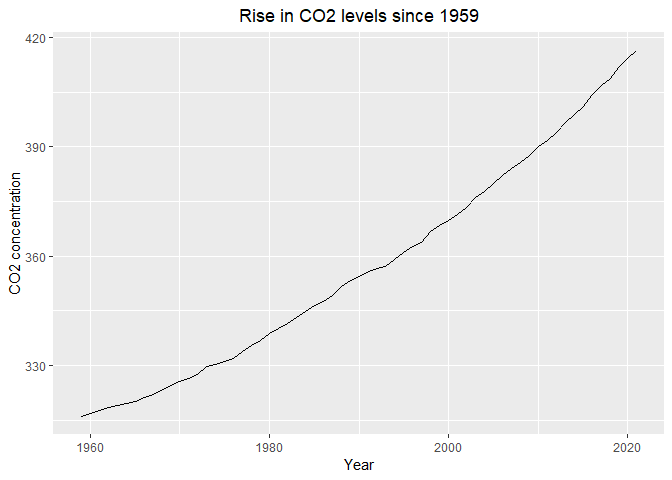

Case Study 8
================
Adrian Elie
10/25/2022

``` r
library(tidyverse)
library(ggplot2)
library(kableExtra)

CO <- read_table("ftp://aftp.cmdl.noaa.gov/products/trends/co2/co2_annmean_mlo.txt", skip = 56)
```

    ## 
    ## -- Column specification --------------------------------------------------------
    ## cols(
    ##   `#` = col_double(),
    ##   year = col_double(),
    ##   mean = col_double(),
    ##   unc = col_character()
    ## )

    ## Warning: 63 parsing failures.
    ## row col  expected    actual                                                               file
    ##   1  -- 4 columns 3 columns 'ftp://aftp.cmdl.noaa.gov/products/trends/co2/co2_annmean_mlo.txt'
    ##   2  -- 4 columns 3 columns 'ftp://aftp.cmdl.noaa.gov/products/trends/co2/co2_annmean_mlo.txt'
    ##   3  -- 4 columns 3 columns 'ftp://aftp.cmdl.noaa.gov/products/trends/co2/co2_annmean_mlo.txt'
    ##   4  -- 4 columns 3 columns 'ftp://aftp.cmdl.noaa.gov/products/trends/co2/co2_annmean_mlo.txt'
    ##   5  -- 4 columns 3 columns 'ftp://aftp.cmdl.noaa.gov/products/trends/co2/co2_annmean_mlo.txt'
    ## ... ... ......... ......... ..................................................................
    ## See problems(...) for more details.

``` r
CO

print(CO, n = 60)

Workplease <- ggplot(CO, aes(x = `#`, y = year))+ 
geom_line()+
labs(x = "Year", y = "CO2 concentration")+
ggtitle("Rise in CO2 levels since 1959") +
theme(plot.title = element_text(hjust = 0.5)) 

Workplease
```

<!-- -->

``` r
table <- knitr::kable(CO, formal = "pipe",) 

table
```

<table>
<thead>
<tr>
<th style="text-align:right;">
#
</th>
<th style="text-align:right;">
year
</th>
<th style="text-align:right;">
mean
</th>
<th style="text-align:left;">
unc
</th>
</tr>
</thead>
<tbody>
<tr>
<td style="text-align:right;">
1959
</td>
<td style="text-align:right;">
315.98
</td>
<td style="text-align:right;">
0.12
</td>
<td style="text-align:left;">
NA
</td>
</tr>
<tr>
<td style="text-align:right;">
1960
</td>
<td style="text-align:right;">
316.91
</td>
<td style="text-align:right;">
0.12
</td>
<td style="text-align:left;">
NA
</td>
</tr>
<tr>
<td style="text-align:right;">
1961
</td>
<td style="text-align:right;">
317.64
</td>
<td style="text-align:right;">
0.12
</td>
<td style="text-align:left;">
NA
</td>
</tr>
<tr>
<td style="text-align:right;">
1962
</td>
<td style="text-align:right;">
318.45
</td>
<td style="text-align:right;">
0.12
</td>
<td style="text-align:left;">
NA
</td>
</tr>
<tr>
<td style="text-align:right;">
1963
</td>
<td style="text-align:right;">
318.99
</td>
<td style="text-align:right;">
0.12
</td>
<td style="text-align:left;">
NA
</td>
</tr>
<tr>
<td style="text-align:right;">
1964
</td>
<td style="text-align:right;">
319.62
</td>
<td style="text-align:right;">
0.12
</td>
<td style="text-align:left;">
NA
</td>
</tr>
<tr>
<td style="text-align:right;">
1965
</td>
<td style="text-align:right;">
320.04
</td>
<td style="text-align:right;">
0.12
</td>
<td style="text-align:left;">
NA
</td>
</tr>
<tr>
<td style="text-align:right;">
1966
</td>
<td style="text-align:right;">
321.37
</td>
<td style="text-align:right;">
0.12
</td>
<td style="text-align:left;">
NA
</td>
</tr>
<tr>
<td style="text-align:right;">
1967
</td>
<td style="text-align:right;">
322.18
</td>
<td style="text-align:right;">
0.12
</td>
<td style="text-align:left;">
NA
</td>
</tr>
<tr>
<td style="text-align:right;">
1968
</td>
<td style="text-align:right;">
323.05
</td>
<td style="text-align:right;">
0.12
</td>
<td style="text-align:left;">
NA
</td>
</tr>
<tr>
<td style="text-align:right;">
1969
</td>
<td style="text-align:right;">
324.62
</td>
<td style="text-align:right;">
0.12
</td>
<td style="text-align:left;">
NA
</td>
</tr>
<tr>
<td style="text-align:right;">
1970
</td>
<td style="text-align:right;">
325.68
</td>
<td style="text-align:right;">
0.12
</td>
<td style="text-align:left;">
NA
</td>
</tr>
<tr>
<td style="text-align:right;">
1971
</td>
<td style="text-align:right;">
326.32
</td>
<td style="text-align:right;">
0.12
</td>
<td style="text-align:left;">
NA
</td>
</tr>
<tr>
<td style="text-align:right;">
1972
</td>
<td style="text-align:right;">
327.46
</td>
<td style="text-align:right;">
0.12
</td>
<td style="text-align:left;">
NA
</td>
</tr>
<tr>
<td style="text-align:right;">
1973
</td>
<td style="text-align:right;">
329.68
</td>
<td style="text-align:right;">
0.12
</td>
<td style="text-align:left;">
NA
</td>
</tr>
<tr>
<td style="text-align:right;">
1974
</td>
<td style="text-align:right;">
330.19
</td>
<td style="text-align:right;">
0.12
</td>
<td style="text-align:left;">
NA
</td>
</tr>
<tr>
<td style="text-align:right;">
1975
</td>
<td style="text-align:right;">
331.13
</td>
<td style="text-align:right;">
0.12
</td>
<td style="text-align:left;">
NA
</td>
</tr>
<tr>
<td style="text-align:right;">
1976
</td>
<td style="text-align:right;">
332.03
</td>
<td style="text-align:right;">
0.12
</td>
<td style="text-align:left;">
NA
</td>
</tr>
<tr>
<td style="text-align:right;">
1977
</td>
<td style="text-align:right;">
333.84
</td>
<td style="text-align:right;">
0.12
</td>
<td style="text-align:left;">
NA
</td>
</tr>
<tr>
<td style="text-align:right;">
1978
</td>
<td style="text-align:right;">
335.41
</td>
<td style="text-align:right;">
0.12
</td>
<td style="text-align:left;">
NA
</td>
</tr>
<tr>
<td style="text-align:right;">
1979
</td>
<td style="text-align:right;">
336.84
</td>
<td style="text-align:right;">
0.12
</td>
<td style="text-align:left;">
NA
</td>
</tr>
<tr>
<td style="text-align:right;">
1980
</td>
<td style="text-align:right;">
338.76
</td>
<td style="text-align:right;">
0.12
</td>
<td style="text-align:left;">
NA
</td>
</tr>
<tr>
<td style="text-align:right;">
1981
</td>
<td style="text-align:right;">
340.12
</td>
<td style="text-align:right;">
0.12
</td>
<td style="text-align:left;">
NA
</td>
</tr>
<tr>
<td style="text-align:right;">
1982
</td>
<td style="text-align:right;">
341.48
</td>
<td style="text-align:right;">
0.12
</td>
<td style="text-align:left;">
NA
</td>
</tr>
<tr>
<td style="text-align:right;">
1983
</td>
<td style="text-align:right;">
343.15
</td>
<td style="text-align:right;">
0.12
</td>
<td style="text-align:left;">
NA
</td>
</tr>
<tr>
<td style="text-align:right;">
1984
</td>
<td style="text-align:right;">
344.87
</td>
<td style="text-align:right;">
0.12
</td>
<td style="text-align:left;">
NA
</td>
</tr>
<tr>
<td style="text-align:right;">
1985
</td>
<td style="text-align:right;">
346.35
</td>
<td style="text-align:right;">
0.12
</td>
<td style="text-align:left;">
NA
</td>
</tr>
<tr>
<td style="text-align:right;">
1986
</td>
<td style="text-align:right;">
347.61
</td>
<td style="text-align:right;">
0.12
</td>
<td style="text-align:left;">
NA
</td>
</tr>
<tr>
<td style="text-align:right;">
1987
</td>
<td style="text-align:right;">
349.31
</td>
<td style="text-align:right;">
0.12
</td>
<td style="text-align:left;">
NA
</td>
</tr>
<tr>
<td style="text-align:right;">
1988
</td>
<td style="text-align:right;">
351.69
</td>
<td style="text-align:right;">
0.12
</td>
<td style="text-align:left;">
NA
</td>
</tr>
<tr>
<td style="text-align:right;">
1989
</td>
<td style="text-align:right;">
353.20
</td>
<td style="text-align:right;">
0.12
</td>
<td style="text-align:left;">
NA
</td>
</tr>
<tr>
<td style="text-align:right;">
1990
</td>
<td style="text-align:right;">
354.45
</td>
<td style="text-align:right;">
0.12
</td>
<td style="text-align:left;">
NA
</td>
</tr>
<tr>
<td style="text-align:right;">
1991
</td>
<td style="text-align:right;">
355.70
</td>
<td style="text-align:right;">
0.12
</td>
<td style="text-align:left;">
NA
</td>
</tr>
<tr>
<td style="text-align:right;">
1992
</td>
<td style="text-align:right;">
356.54
</td>
<td style="text-align:right;">
0.12
</td>
<td style="text-align:left;">
NA
</td>
</tr>
<tr>
<td style="text-align:right;">
1993
</td>
<td style="text-align:right;">
357.21
</td>
<td style="text-align:right;">
0.12
</td>
<td style="text-align:left;">
NA
</td>
</tr>
<tr>
<td style="text-align:right;">
1994
</td>
<td style="text-align:right;">
358.96
</td>
<td style="text-align:right;">
0.12
</td>
<td style="text-align:left;">
NA
</td>
</tr>
<tr>
<td style="text-align:right;">
1995
</td>
<td style="text-align:right;">
360.97
</td>
<td style="text-align:right;">
0.12
</td>
<td style="text-align:left;">
NA
</td>
</tr>
<tr>
<td style="text-align:right;">
1996
</td>
<td style="text-align:right;">
362.74
</td>
<td style="text-align:right;">
0.12
</td>
<td style="text-align:left;">
NA
</td>
</tr>
<tr>
<td style="text-align:right;">
1997
</td>
<td style="text-align:right;">
363.88
</td>
<td style="text-align:right;">
0.12
</td>
<td style="text-align:left;">
NA
</td>
</tr>
<tr>
<td style="text-align:right;">
1998
</td>
<td style="text-align:right;">
366.84
</td>
<td style="text-align:right;">
0.12
</td>
<td style="text-align:left;">
NA
</td>
</tr>
<tr>
<td style="text-align:right;">
1999
</td>
<td style="text-align:right;">
368.54
</td>
<td style="text-align:right;">
0.12
</td>
<td style="text-align:left;">
NA
</td>
</tr>
<tr>
<td style="text-align:right;">
2000
</td>
<td style="text-align:right;">
369.71
</td>
<td style="text-align:right;">
0.12
</td>
<td style="text-align:left;">
NA
</td>
</tr>
<tr>
<td style="text-align:right;">
2001
</td>
<td style="text-align:right;">
371.32
</td>
<td style="text-align:right;">
0.12
</td>
<td style="text-align:left;">
NA
</td>
</tr>
<tr>
<td style="text-align:right;">
2002
</td>
<td style="text-align:right;">
373.45
</td>
<td style="text-align:right;">
0.12
</td>
<td style="text-align:left;">
NA
</td>
</tr>
<tr>
<td style="text-align:right;">
2003
</td>
<td style="text-align:right;">
375.98
</td>
<td style="text-align:right;">
0.12
</td>
<td style="text-align:left;">
NA
</td>
</tr>
<tr>
<td style="text-align:right;">
2004
</td>
<td style="text-align:right;">
377.70
</td>
<td style="text-align:right;">
0.12
</td>
<td style="text-align:left;">
NA
</td>
</tr>
<tr>
<td style="text-align:right;">
2005
</td>
<td style="text-align:right;">
379.98
</td>
<td style="text-align:right;">
0.12
</td>
<td style="text-align:left;">
NA
</td>
</tr>
<tr>
<td style="text-align:right;">
2006
</td>
<td style="text-align:right;">
382.09
</td>
<td style="text-align:right;">
0.12
</td>
<td style="text-align:left;">
NA
</td>
</tr>
<tr>
<td style="text-align:right;">
2007
</td>
<td style="text-align:right;">
384.02
</td>
<td style="text-align:right;">
0.12
</td>
<td style="text-align:left;">
NA
</td>
</tr>
<tr>
<td style="text-align:right;">
2008
</td>
<td style="text-align:right;">
385.83
</td>
<td style="text-align:right;">
0.12
</td>
<td style="text-align:left;">
NA
</td>
</tr>
<tr>
<td style="text-align:right;">
2009
</td>
<td style="text-align:right;">
387.64
</td>
<td style="text-align:right;">
0.12
</td>
<td style="text-align:left;">
NA
</td>
</tr>
<tr>
<td style="text-align:right;">
2010
</td>
<td style="text-align:right;">
390.10
</td>
<td style="text-align:right;">
0.12
</td>
<td style="text-align:left;">
NA
</td>
</tr>
<tr>
<td style="text-align:right;">
2011
</td>
<td style="text-align:right;">
391.85
</td>
<td style="text-align:right;">
0.12
</td>
<td style="text-align:left;">
NA
</td>
</tr>
<tr>
<td style="text-align:right;">
2012
</td>
<td style="text-align:right;">
394.06
</td>
<td style="text-align:right;">
0.12
</td>
<td style="text-align:left;">
NA
</td>
</tr>
<tr>
<td style="text-align:right;">
2013
</td>
<td style="text-align:right;">
396.74
</td>
<td style="text-align:right;">
0.12
</td>
<td style="text-align:left;">
NA
</td>
</tr>
<tr>
<td style="text-align:right;">
2014
</td>
<td style="text-align:right;">
398.81
</td>
<td style="text-align:right;">
0.12
</td>
<td style="text-align:left;">
NA
</td>
</tr>
<tr>
<td style="text-align:right;">
2015
</td>
<td style="text-align:right;">
401.01
</td>
<td style="text-align:right;">
0.12
</td>
<td style="text-align:left;">
NA
</td>
</tr>
<tr>
<td style="text-align:right;">
2016
</td>
<td style="text-align:right;">
404.41
</td>
<td style="text-align:right;">
0.12
</td>
<td style="text-align:left;">
NA
</td>
</tr>
<tr>
<td style="text-align:right;">
2017
</td>
<td style="text-align:right;">
406.76
</td>
<td style="text-align:right;">
0.12
</td>
<td style="text-align:left;">
NA
</td>
</tr>
<tr>
<td style="text-align:right;">
2018
</td>
<td style="text-align:right;">
408.72
</td>
<td style="text-align:right;">
0.12
</td>
<td style="text-align:left;">
NA
</td>
</tr>
<tr>
<td style="text-align:right;">
2019
</td>
<td style="text-align:right;">
411.66
</td>
<td style="text-align:right;">
0.12
</td>
<td style="text-align:left;">
NA
</td>
</tr>
<tr>
<td style="text-align:right;">
2020
</td>
<td style="text-align:right;">
414.24
</td>
<td style="text-align:right;">
0.12
</td>
<td style="text-align:left;">
NA
</td>
</tr>
<tr>
<td style="text-align:right;">
2021
</td>
<td style="text-align:right;">
416.45
</td>
<td style="text-align:right;">
0.12
</td>
<td style="text-align:left;">
NA
</td>
</tr>
</tbody>
</table>
